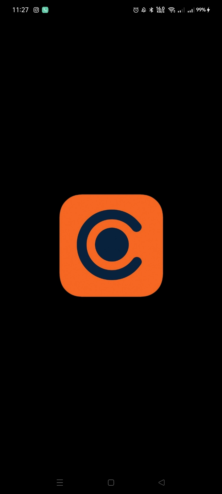
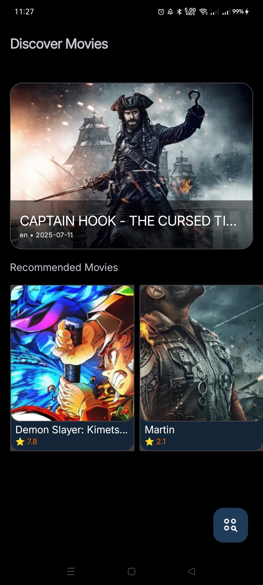

# 🎬 Cameo - Movie & TV Show Discovery App

[](https://dl.circleci.com/status-badge/redirect/gh/halimjr11/Cameo/tree/MADE%2Fsubmission-1)

## 📱 Screenshots
<div align="center">
  
</div>

## 📝 Description
Cameo is a modern Android application for discovering movies. Built with clean architecture principles and modern Android development practices.

---

## 🛠 Tech Stack

### Core
- **Language**: Kotlin
- **Android**: minSdk 27, targetSdk 36, AGP 8.13.0
- **UI**: View Binding, Material Components, ConstraintLayout, Lottie
- **Navigation**: AndroidX Navigation (Safe Args)
- **DI**: Koin
- **Data**:
  - Retrofit + Gson Converter
  - OkHttp Logging Interceptor
  - Room (runtime, ktx, paging)
  - SQLCipher for database encryption
- **Security**:
  - SSL Pinning with Certificate Transparency
  - Encrypted SharedPreferences
  - ProGuard/R8 for code obfuscation
- **Concurrency**: Kotlin Coroutines
- **Media**: CameraX (camera2, lifecycle, view), Coil image loader
- **Location/Maps**: Google Play Services Location + Maps
- **Debug/Logs**: Chucker (debug only), Timber
- **Testing**: JUnit 5, MockK, Coroutines Test, AndroidX Core Testing, Koin Test

### Architecture


### Design Patterns


---

## 📷 Screenshots

| Splash Screen                                  | Home                                         | Event Details                                  |
|------------------------------------------------|----------------------------------------------|------------------------------------------------|
|  |  |  |

---


## 🚀 Installation
1. Clone the repository:
   ```bash
   git clone https://github.com/halimjr11/Cameo.git
   ```
2. Open the project in Android Studio Arctic Fox or later
3. Sync the project with Gradle files
4. Build and run the app on your emulator or physical device

## 🔒 Security Implementation

### Database Encryption with SQLCipher
This app uses SQLCipher to encrypt the local Room database. The encryption key is securely stored in the Android Keystore System.

```kotlin
// Example of SQLCipher setup
val factory = SupportFactory(SQLiteDatabase.getBytes("your-secure-password".toCharArray()))
Room.databaseBuilder(context, AppDatabase::class.java, "encrypted-db.db")
    .openHelperFactory(factory)
    .build()
```

### SSL Pinning
Network security is enforced using Certificate Pinning with OkHttp's CertificatePinner:

```kotlin
val certificatePinner = CertificatePinner.Builder()
    .add("api.themoviedb.org", "sha256/AAAAAAAAAAAAAAAAAAAAAAAAAAAAAAAAAAAAAAAAAAA=")
    .add("api.themoviedb.org", "sha256/BBBBBBBBBBBBBBBBBBBBBBBBBBBBBBBBBBBBBBBBBBB=")
    .add("api.themoviedb.org", "sha256/CCCCCCCCCCCCCCCCCCCCCCCCCCCCCCCCCCCCCCCCCCC=")
    .build()

val okHttpClient = OkHttpClient.Builder()
    .certificatePinner(certificatePinner)
    .build()
```

### API Configuration
This project uses The Movie Database (TMDb) API. You need to add the following configurations to `local.properties`:

```properties
# TMDb API Configuration
API_KEY=your_api_key_here
BASE_URL=https://api.themoviedb.org/3/

# SSL Pinning Configuration
# Replace with your actual certificate public key hashes (SHA-256)
CERT_1=sha256/AAAAAAAAAAAAAAAAAAAAAAAAAAAAAAAAAAAAAAAAAAA=
CERT_2=sha256/BBBBBBBBBBBBBBBBBBBBBBBBBBBBBBBBBBBBBBBBBBB=
CERT_3=sha256/CCCCCCCCCCCCCCCCCCCCCCCCCCCCCCCCCCCCCCCCCCC=

# Database Encryption
# Generate a strong password and store it securely
DB_PASSWORD=your_secure_database_password
```

### How to Get API Key
1. Create an account at [The Movie Database](https://www.themoviedb.org/)
2. Go to your profile settings > API section
3. Request an API key (v3 auth)
4. Replace `your_api_key_here` with your actual API key

---

## 🤝 Contributing
Contributions are welcome! Please feel free to submit a Pull Request.

---

## 📄 License
```
MIT License

Copyright (c) 2025 Nurhaq Halim

Permission is hereby granted, free of charge, to any person obtaining a copy
of this software and associated documentation files (the "Software"), to deal
in the Software without restriction, including without limitation the rights
to use, copy, modify, merge, publish, distribute, sublicense, and/or sell
copies of the Software, and to permit persons to whom the Software is
furnished to do so, subject to the following conditions:

The above copyright notice and this permission notice shall be included in all
copies or substantial portions of the Software.

THE SOFTWARE IS PROVIDED "AS IS", WITHOUT WARRANTY OF ANY KIND, EXPRESS OR
IMPLIED, INCLUDING BUT NOT LIMITED TO THE WARRANTIES OF MERCHANTABILITY,
FITNESS FOR A PARTICULAR PURPOSE AND NONINFRINGEMENT. IN NO EVENT SHALL THE
AUTHORS OR COPYRIGHT HOLDERS BE LIABLE FOR ANY CLAIM, DAMAGES OR OTHER
LIABILITY, WHETHER IN AN ACTION OF CONTRACT, TORT OR OTHERWISE, ARISING FROM,
OUT OF OR IN CONNECTION WITH THE SOFTWARE OR THE USE OR OTHER DEALINGS IN THE
SOFTWARE.
```

---

## 🙏 Acknowledgements
- **Developer**: [Halim](https://github.com/halimjr11)
- **Kotlin**: [Kotlin Programming Language](https://kotlinlang.org/)
- **Android**: [Android Developers](https://developer.android.com/)
- **Dicoding**: [Dicoding](https://www.dicoding.com/)
- All open-source libraries used in this project

---
